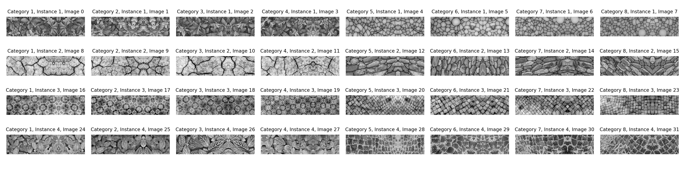
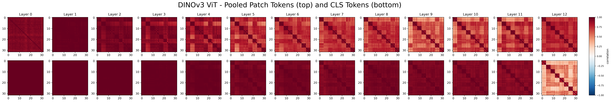
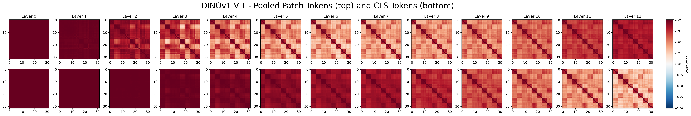
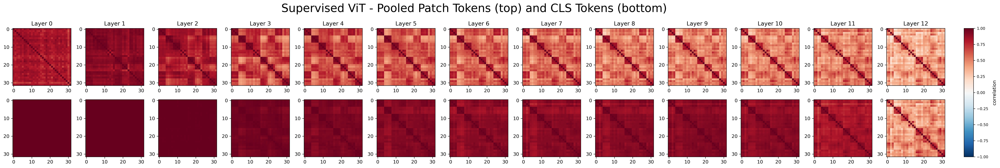
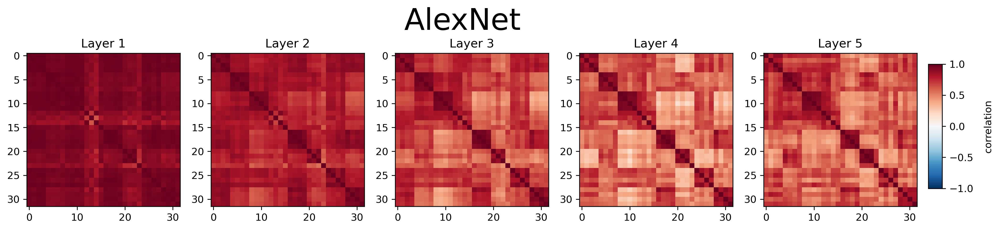
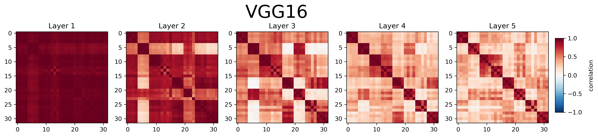
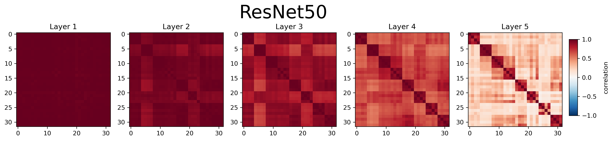
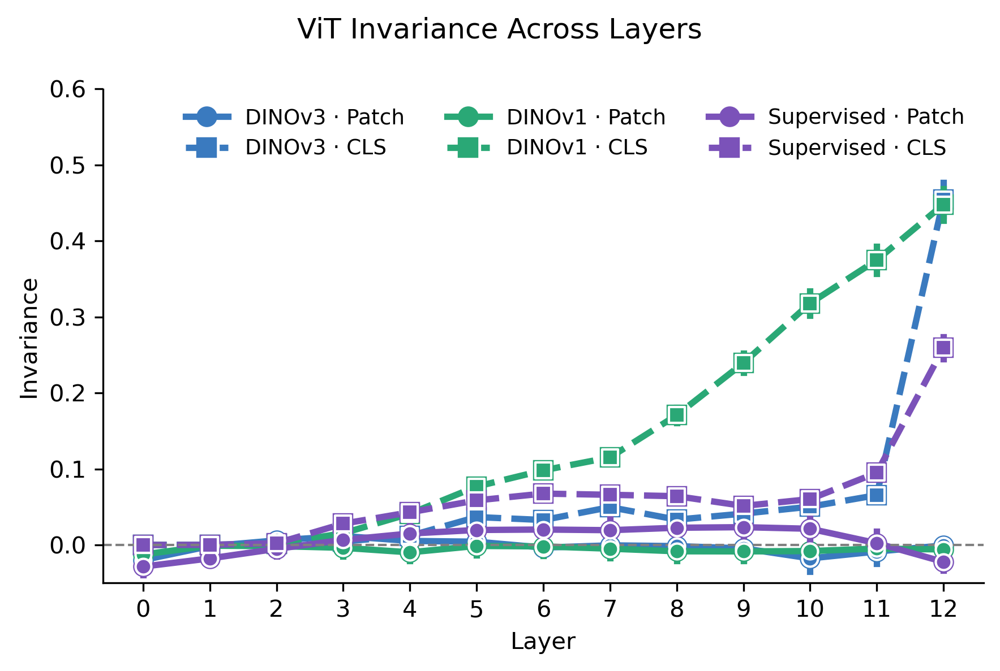
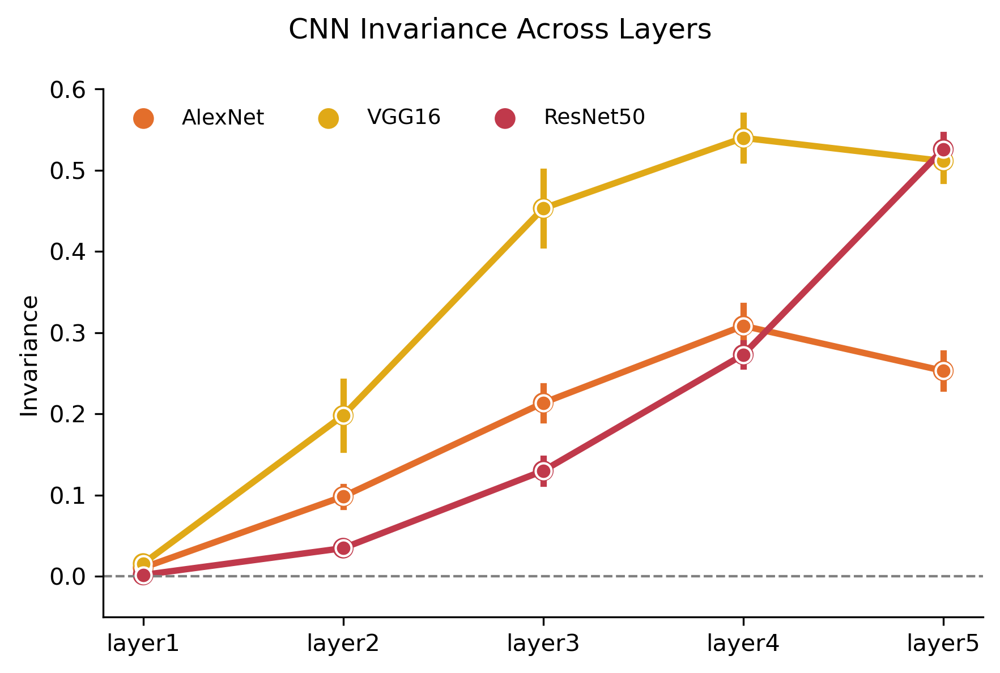

# Visual Invariance Analysis of CNNs and ViTs

This repository analyzes how different model architectures and training paradigms shape the invariance of internal representations across layers, comparing Vision Transformers (ViTs) with classic CNN models on a controlled texture stimulus set.

We compare:
- **DINOv3** — large-scale self-supervised ViT foundation model
- **DINOv1** — self-supervised ViT trained on ImageNet
- **Supervised ViT** — ViT trained on ImageNet with classification loss
- **AlexNet** — classic shallow CNN
- **VGG16** — deep CNN 
- **ResNet50** — deep CNN with residual connections

using a stimulus set of:
- 8 texture categories: *Leaves, Circles, Dryland, Rocks, Tiles, Squares, Rleaves, Paved*
- 4 images per category
- 32 total images

  

---

## Experimental Pipeline

For each model:

1. Extract hidden states from all layers:
   - CLS token embeddings (ViTs only)
   - Mean-pooled patch token embeddings (ViTs only)
   - Pooled feature maps (CNNs)
2. Compute a 32×32 pairwise representation correlation matrix per layer
3. Quantify pair invariance from within-category and between-category correlations

All ViTs are implemented in PyTorch using HuggingFace Transformers.

---

## Invariance Measure

### Representation Matrix

For each layer, we compute a pairwise Pearson correlation matrix $R$ across all stimuli:

$$R_{ij} = \text{corr}(f_i, f_j)$$

where $f_i$ and $f_j$ are the feature vectors of stimuli $i$ and $j$ at a given layer.

### Pair Invariance

For each pair of categories $(A, B)$, pair invariance is defined as:

$$\text{Invariance}(A, B) = \frac{R_{AA} + R_{BB}}{2} - R_{AB}$$

where $R_{AA}$ and $R_{BB}$ are the mean within-category correlations for categories $A$ and $B$, and $R_{AB}$ is the mean between-category correlation. A higher value indicates that the representation is more invariant to within-category variation relative to between-category differences.

Pair invariance is computed across all $\binom{8}{2} = 28$ category pairs.

---

## Results

### 1. Representation Correlation Matrices (ViT Models)

The correlation matrices show how representations evolve layer by layer. Darker diagonal blocks indicate strong within-category similarity, while lighter off-diagonal blocks indicate separation between categories.

**DINOv3** maintains high overall correlation magnitude across all layers, with the diagonal block structure emerging gradually due to the decrease in the between-category correlation:

**DINOv1** shows a strong decorrelation in intermediate patch token layers (roughly layers 4–8), but becomes more correlated in the later layers. The CLS token representations are uniformly decorrelated across categories throughout:

**Supervised ViT** shows a cleaner and more progressive block structure for the patch tokens. With a fast decorrelation of the last cls token, consistent with a discriminative training objective that encourages category separation:

---

### 2. Representation Correlation Matrices — CNN Models

CNN representations show a progressive structuring across layers in all three models, with increasingly clear category block structure from early to late layers.

All three CNNs start with near-uniform high correlation in early layers, and develop progressively more distinct category blocks in deeper layers. VGG16 shows notably faster decorrelation in early layers compared to AlexNet and ResNet50.

The stronger intermediate decorrelation in VGG16 may be related to its greater depth and the absence of skip connections, which forces each layer to carry more of the abstract information. ResNet50's skip connections may smooth this process across layers.

For **AlexNet**, we extracted feature maps after each convolutional stage (post-ReLU and post-pooling when applicable). Specifically:

1. Conv1 + ReLU + MaxPool  
2. Conv2 + ReLU + MaxPool  
3. Conv3 + ReLU  
4. Conv4 + ReLU  
5. Conv5 + ReLU + MaxPool  

  

For **VGG16**, we extracted the output of the **last convolutional layer within each block**, after ReLU activation and before the classifier. Specifically:

1. Block1: after Conv1_2  
2. Block2: after Conv2_2  
3. Block3: after Conv3_3  
4. Block4: after Conv4_3  
5. Block5: after Conv5_3  

  

For **ResNet50**, we extracted:

1. The output after the initial convolution + maxpool 

and the output of the **last residual block in each stage**:

  2. model Layer1 
  3. model Layer2 
  4. model Layer3 
  5. model Layer4 

  

---

### 3. Invariance Across Layers

  
  

**ViT models (left):** Patch token invariance rises steeply in early-to-middle layers for all three models and then plateaus or declines. DINOv1 patch tokens show a distinctive inverted-U pattern, peaking around layer 6 with notably higher maximum invariance (~0.44) than DINOv3 (~0.30) or Supervised ViT (~0.27) before declining sharply in later layers. DINOv3 and Supervised ViT patch tokens both plateau earlier and remain more stable. CLS token invariance is substantially lower across all models throughout the network, with a sharp increase only in the final layers. The final CLS tokens of the two self-supervised models reach higher invariance than the supervised ViT, consistent with self-supervised objectives learning more invariant representations without explicit category labels.

**CNN models (right):** All three CNNs show a monotonic increase in invariance across layers. VGG16 and ResNet50 reach substantially higher final invariance (~0.52–0.54) than AlexNet (~0.26). AlexNet plateaus early and shows a slight decrease at the final layer.

---

## Summary

The key finding from the ViT analysis is that **self-supervised training (DINOv1 and DINOv3) 
produces final CLS token representations with higher invariance than supervised 
training**, despite never receiving explicit category labels. This suggests that 
self-supervised objectives are sufficient for building 
invariant texture representations. 

For CNN models, architecture and depth are the dominant 
factors: VGG16 and ResNet50 accumulate substantially more invariance across layers than AlexNet.

The training dataset does not appear to be a primary driver of invariance differences.
DINOv1 and Supervised ViT were both trained on ImageNet, while DINOv3 was trained on
a larger curated dataset (LVD-1689M), yet both DINO models show similar levels of final CLS token
invariance. This suggests that the differences we observe are more likely driven by
training objective and architecture than by dataset content, as all datasets contain
sufficient images with texture statistics similar to our stimulus set.

---

## Broader Relevance

The broader research motivation is to understand how artificial visual representations compare to biological visual systems (e.g., mouse visual cortex). While no neural data is included in this repository, this analysis forms part of a larger effort investigating representational alignment between the brain and the AI models.

---

## Author Info

**Fengtong (Farah) Du** — coding  
**Miguel Angel Nuñez Ochoa** — invariance metric design
